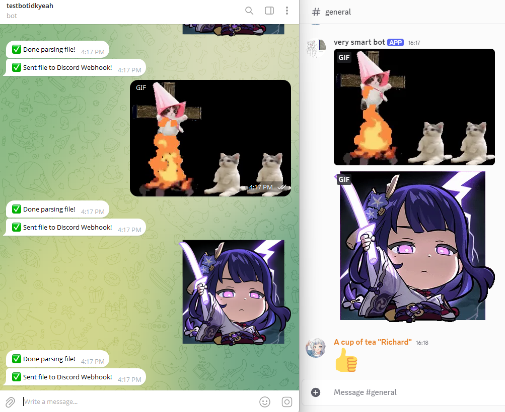

# Telegram Gifs (and stickers too) For Discord!

---

## Run With Docker

`1. run config-env.sh`

`2. docker compose up -d`

## run Without Docker

`1. install node x16`

`2. install git`

`3. git clone https://github.com/RichardsCoffeeShop/telegram-to-discord-gif`

`4. npm install`

`5. run config-env.sh`

`6. npm run start`

# references

how create telegram bot:

- https://www.siteguarding.com/en/how-to-get-telegram-bot-api-token

how create a webhook on a Discord channel:

- https://www.youtube.com/watch?v=fKksxz2Gdnc
